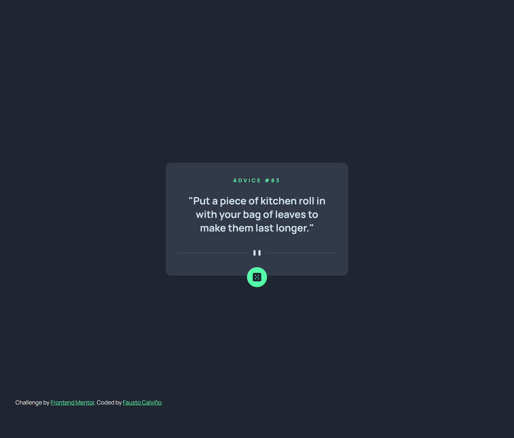

# Frontend Mentor - Advice generator app solution

This is a solution to the [Advice generator app challenge on Frontend Mentor](https://www.frontendmentor.io/challenges/advice-generator-app-QdUG-13db). Frontend Mentor challenges help you improve your coding skills by building realistic projects.

## Table of contents

- [Overview](#overview)
  - [The challenge](#the-challenge)
  - [Screenshot](#screenshot)
  - [Links](#links)
- [My process](#my-process)
  - [Built with](#built-with)
  - [What I learned](#what-i-learned)
  - [Useful resources](#useful-resources)
- [Author](#author)


## Overview

### The challenge

Users should be able to:

- View the optimal layout for the app depending on their device's screen size
- See hover states for all interactive elements on the page
- Generate a new piece of advice by clicking the dice icon

### Screenshot




### Links

- Solution URL: [https://www.frontendmentor.io/solutions/advice-generator-app-using-html-css-and-javascript-SJSwIwLUc](https://www.frontendmentor.io/solutions/advice-generator-app-using-html-css-and-javascript-SJSwIwLUc)
- Live Site URL: [https://advice-generator-app-fcc.netlify.app/](https://advice-generator-app-fcc.netlify.app/)

## My process

### Built with

- Semantic HTML5 markup
- CSS custom properties
- Flexbox
- Fetch function


### What I learned

The most important thing I have learnt in this challenge is to use fetch function in JavaScript, in order to generate a new advice everytime the user click on the dice icon.


```js
const getAdvice=async()=>{
  try{
    const resp=await fetch(url);
    const data=await resp.json();
    const answerId=data.slip.id;
    const answerAdvice=data.slip.advice;
    idAdvice.innerHTML=answerId;
    headerAdvice.innerHTML=answerAdvice;
  } catch (err){
    console.log(`Something went wrong! ${err}`)
  }
};
```


### Useful resources

- [MDN Fetch API documentation](https://developer.mozilla.org/en-US/docs/Web/API/Fetch_API) - This helped me to understand the fetch function in JavaScript.


## Author

- Website - [Personal Portfolio](https://faustocalvinio.netlify.app/)
- Frontend Mentor - [@faustocalvinio](https://www.frontendmentor.io/profile/faustocalvinio)


