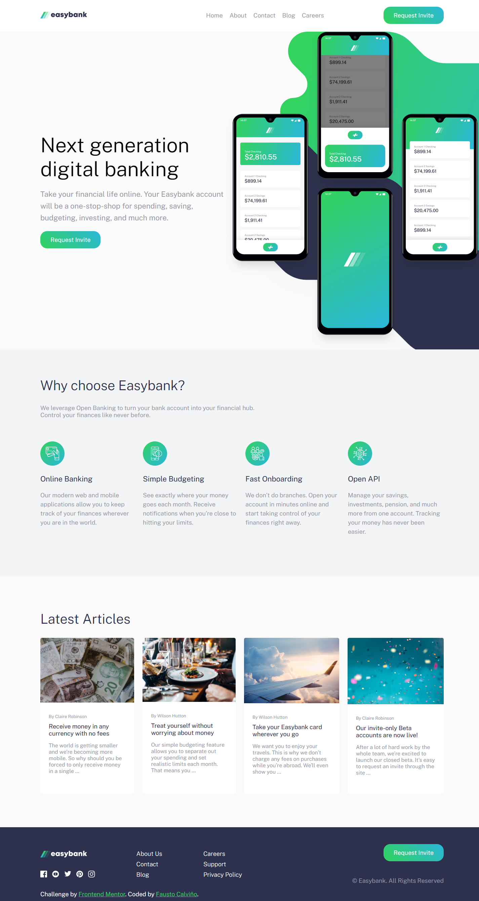

# Frontend Mentor - Easybank landing page solution

This is a solution to the [Easybank landing page challenge on Frontend Mentor](https://www.frontendmentor.io/challenges/easybank-landing-page-WaUhkoDN). Frontend Mentor challenges help you improve your coding skills by building realistic projects. 

## Table of contents

- [Overview](#overview)
  - [The challenge](#the-challenge)
  - [Screenshot](#screenshot)
  - [Links](#links)
- [My process](#my-process)
  - [Built with](#built-with)  
  - [Useful resources](#useful-resources)
- [Author](#author)

## Overview

### The challenge

Users should be able to:

- View the optimal layout for the site depending on their device's screen size
- See hover states for all interactive elements on the page

### Screenshot

### Links

- Solution URL: [https://www.frontendmentor.io/solutions/easybank-landing-page-using-html-css-and-javascript-lDbQQsFnPe](https://www.frontendmentor.io/solutions/easybank-landing-page-using-html-css-and-javascript-lDbQQsFnPe)
- Live Site URL: [https://easybank-landing-page-fcc.netlify.app/](https://easybank-landing-page-fcc.netlify.app/)

## My process

### Built with

- Semantic HTML5 markup
- CSS custom properties
- JavaScript
- Flexbox

### Useful resources

- [CSS Box Shadow Generator](https://www.cssmatic.com/es/box-shadow) - This helped me to generate the box shadow of the responsive menu container.
- [CSS Gradient Generator](https://coolors.co/gradient-maker/31d35c-2bb7da?position=0,100&opacity=100,100&type=radial&rotation=90) - This is an amazing article which helped me to create the gradient for the request invite link.

## Author

- Website - [Personal Portfolio](https://faustocalvinio.netlify.app/)
- Frontend Mentor - [@faustocalvinio](https://www.frontendmentor.io/profile/faustocalvinio)
