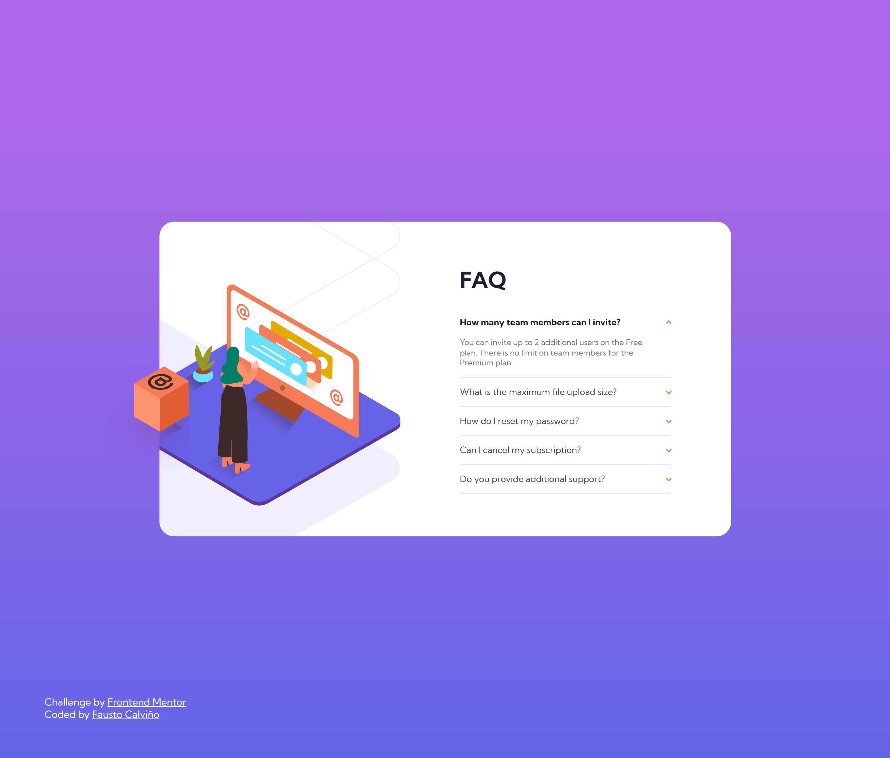

# Frontend Mentor - FAQ accordion card solution

This is a solution to the [FAQ accordion card challenge on Frontend Mentor](https://www.frontendmentor.io/challenges/faq-accordion-card-XlyjD0Oam). Frontend Mentor challenges help you improve your coding skills by building realistic projects. 

## Table of contents

- [Overview](#overview)
  - [The challenge](#the-challenge)
  - [Screenshot](#screenshot)
  - [Links](#links)
- [My process](#my-process)
  - [Built with](#built-with)
  - [What I learned](#what-i-learned)
  - [Useful resources](#useful-resources)
- [Author](#author) 


## Overview

### The challenge

Users should be able to:

- View the optimal layout for the component depending on their device's screen size
- See hover states for all interactive elements on the page
- Hide/Show the answer to a question when the question is clicked

### Screenshot



### Links

- Solution URL: [https://github.com/faustocalvinio/frontendmentor/tree/main/faq-accordion-card-main](https://github.com/faustocalvinio/frontendmentor/tree/main/faq-accordion-card-main)
- Live Site URL: [https://faq-accordion-card-fcc.netlify.app/](https://faq-accordion-card-fcc.netlify.app/)

## My process

### Built with

- Semantic HTML5 markup
- CSS custom properties
- Toggle classlists and Event listeners from JavaScript

### What I learned

I learned to add an event listener for an element a toggle a class for that clicked element.

```js
questions.forEach((question) => {
  const button = question.querySelector(".faq-btn");
  const questionText = question.querySelector(".faq-title");
  button.addEventListener("click", () => {
    questions.forEach((item) => {
      if(item !== question) {
        item.classList.remove("show-text");
      }
    });
    question.classList.toggle("show-text");
  });

  questionText.addEventListener("click", () => {
    questions.forEach((item) => {
      if(item !== question) {
        item.classList.remove("show-text");
      }
    });
    question.classList.toggle("show-text");
  });
});
```

### Useful resources

- [MDN Add Event Listener](https://developer.mozilla.org/en-US/docs/Web/API/EventTarget/addEventListener) - This helped me to add the click event listener for an element.
- [MDN Toggle classList](https://developer.mozilla.org/en-US/docs/Web/API/Element/classList) - This is an article to understand classList property from JavaScript DOM.


## Author

- Website - [Personal Portfolio](https://faustocalvinio.netlify.app/)
- Frontend Mentor - [@faustocalvinio](https://www.frontendmentor.io/profile/faustocalvinio)
