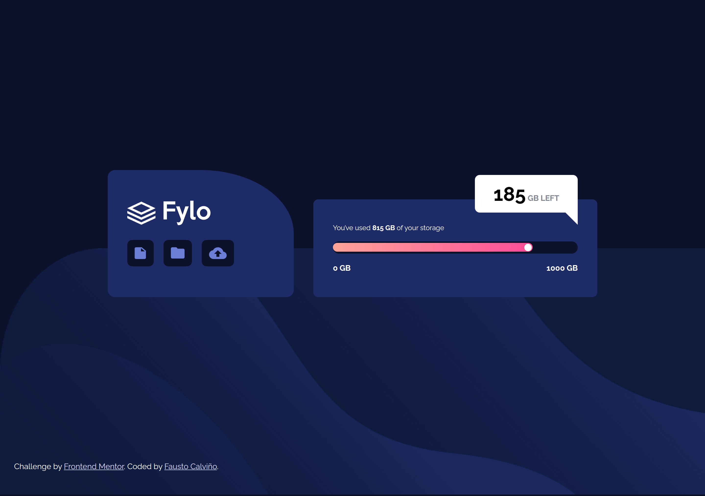

# Frontend Mentor - Fylo data storage component solution

This is a solution to the [Fylo data storage component challenge on Frontend Mentor](https://www.frontendmentor.io/challenges/fylo-data-storage-component-1dZPRbV5n). Frontend Mentor challenges help you improve your coding skills by building realistic projects. 

## Table of contents

- [Overview](#overview)
  - [The challenge](#the-challenge)
  - [Screenshot](#screenshot)
  - [Links](#links)
- [My process](#my-process)
  - [Built with](#built-with)
  - [What I learned](#what-i-learned)
- [Author](#author)


## Overview

### The challenge

Users should be able to:

- View the optimal layout for the site depending on their device's screen size

### Screenshot




### Links

- Solution URL: [https://www.frontendmentor.io/solutions/fylo-data-storage-component-html-and-css-lyF1THxsCY](https://www.frontendmentor.io/solutions/fylo-data-storage-component-html-and-css-lyF1THxsCY)
- Live Site URL: [https://fylo-data-storage-component-fcc.netlify.app/](https://fylo-data-storage-component-fcc.netlify.app/)

## My process

### Built with

- Semantic HTML5 markup
- CSS custom properties
- Flexbox

### What I learned

I made a triangle with CSS for this challenge.


```css
.triangle-white {
    width: 0;
    height: 0;
    border-right: 50px solid #fff;
    border-top: 50px solid #fff;
    border-left: 50px solid transparent;
    border-bottom: 50px solid transparent; 
    position: absolute;
    right: 40px;
    top: -48px;
    border-top-right-radius: 10px;
}
```

## Author

- Website - [Personal Portfolio](https://faustocalvinio.netlify.app/)
- Frontend Mentor - [@faustocalvinio](https://www.frontendmentor.io/profile/faustocalvinio)