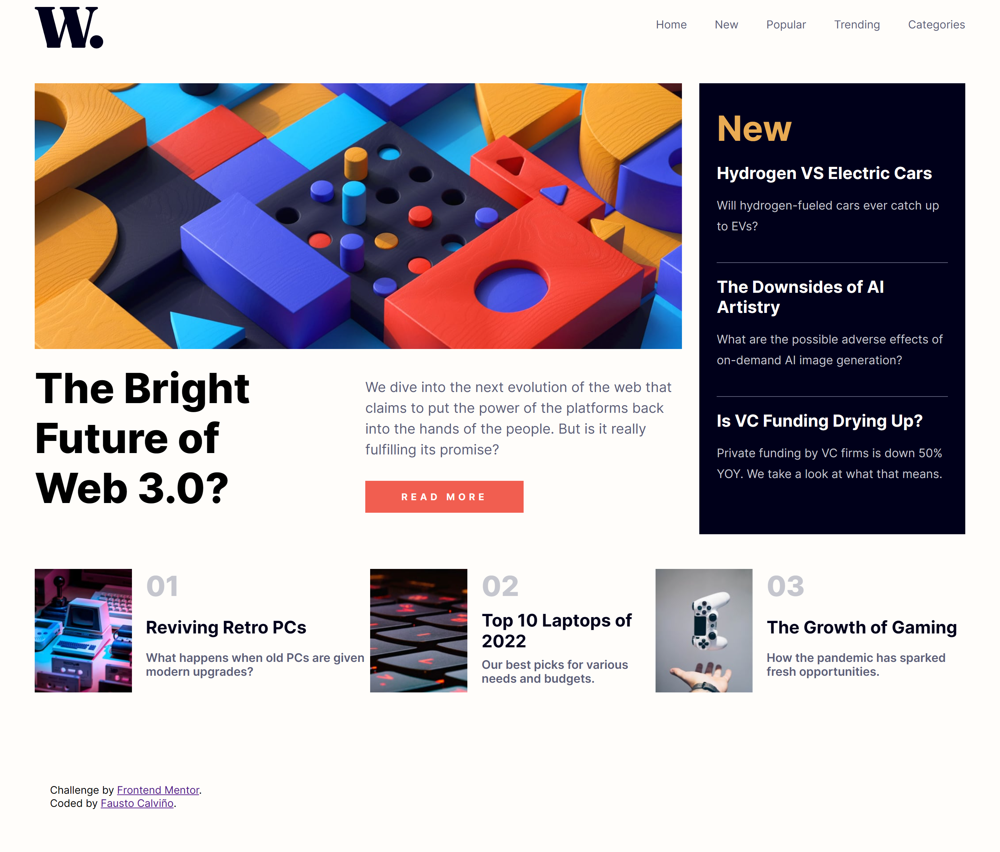

# Frontend Mentor - News homepage solution

This is a solution to the [News homepage challenge on Frontend Mentor](https://www.frontendmentor.io/challenges/news-homepage-H6SWTa1MFl). Frontend Mentor challenges help you improve your coding skills by building realistic projects. 

## Table of contents

- [Overview](#overview)
  - [The challenge](#the-challenge)
  - [Screenshot](#screenshot)
  - [Links](#links)
- [My process](#my-process)
  - [Built with](#built-with)
  - [What I learned](#what-i-learned)
  - [Useful resources](#useful-resources)
- [Author](#author)


## Overview

### The challenge

Users should be able to:

- View the optimal layout for the interface depending on their device's screen size
- See hover and focus states for all interactive elements on the page

### Screenshot



### Links

- Solution URL: [https://www.frontendmentor.io/solutions/news-homepage-challenge-d1euYn2EZfe](https://www.frontendmentor.io/solutions/news-homepage-challenge-d1euYn2EZf)
- Live Site URL: [https://news-homepage-frontend-fcc.netlify.app/](https://news-homepage-frontend-fcc.netlify.app/)

## My process

### Built with

- Semantic HTML5 markup
- CSS custom properties
- Flexbox
- CSS Grid

### What I learned

This challenge was a big practice to use mi CSS Grid skills.

```css
.last-new-item{
    display: grid; 
    grid-template-columns: 140px 1fr; 
    grid-template-rows: repeat(3,auto); 
    gap: 0px 20px; 
    grid-template-areas: 
      "last-new-image last-new-number"
      "last-new-image last-new-title"
      "last-new-image last-new-text";    
}
```

### Useful resources

- [Grid generator](https://grid.layoutit.com/) - Very useful grid generator tool.


## Author

- Website - [Personal Portfolio](https://faustocalvinio.netlify.app/)
- Frontend Mentor - [@faustocalvinio](https://www.frontendmentor.io/profile/faustocalvinio)

