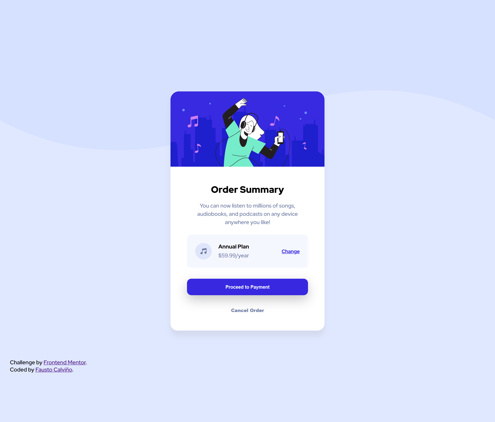

# Frontend Mentor - Order summary card solution

This is a solution to the [Order summary card challenge on Frontend Mentor](https://www.frontendmentor.io/challenges/order-summary-component-QlPmajDUj). Frontend Mentor challenges help you improve your coding skills by building realistic projects. 

## Table of contents

- [Overview](#overview)
  - [The challenge](#the-challenge)
  - [Screenshot](#screenshot)
  - [Links](#links)
- [My process](#my-process)
  - [Built with](#built-with)
  - [What I learned](#what-i-learned)
  - [Useful resources](#useful-resources)
- [Author](#author)


## Overview

### The challenge

Users should be able to:

- See hover states for interactive elements

### Screenshot




### Links

- Solution URL: [https://github.com/faustocalvinio/frontendmentor/tree/main/order-summary](https://github.com/faustocalvinio/frontendmentor/tree/main/order-summary)
- Live Site URL: [https://order-summary-fcc.netlify.app/](https://order-summary-fcc.netlify.app/)

## My process

### Built with

- Semantic HTML5 markup
- CSS custom properties
- Flexbox

### What I learned

I started to use root property in CSS documents.


```css
:root{
    --paleBlue:hsl(225, 100%, 94%);
    --brightblue: hsl(245, 75%, 52%);
    --veryPaleBlue: hsl(225, 100%, 98%);
    --desaturatedBlue: hsl(224, 23%, 55%);
    --darkBlue: hsl(223, 47%, 23%);
}

```


### Useful resources

- [MDN root CSS documentation](https://developer.mozilla.org/es/docs/Web/CSS/:root) - This helped me to use root declaration in a CSS document.


## Author

- Website - [Personal Portfolio](https://faustocalvinio.netlify.app/)
- Frontend Mentor - [@faustocalvinio](https://www.frontendmentor.io/profile/faustocalvinio)
