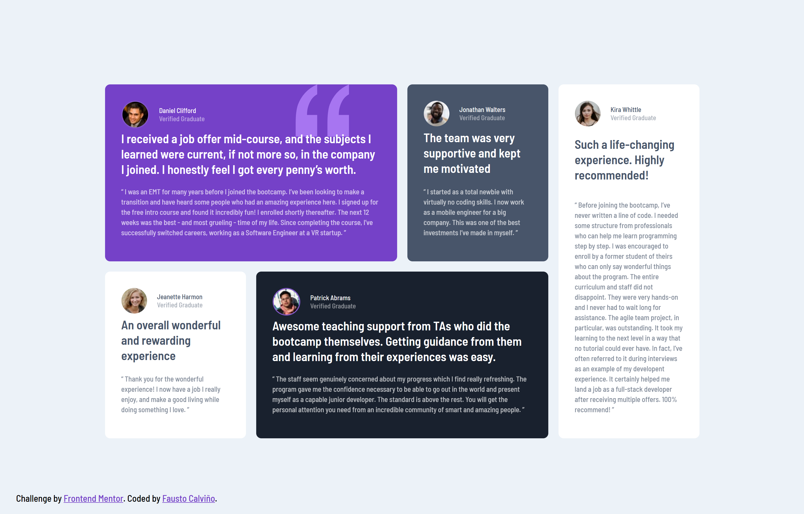

# Frontend Mentor - Testimonials grid section solution

This is a solution to the [Testimonials grid section challenge on Frontend Mentor](https://www.frontendmentor.io/challenges/testimonials-grid-section-Nnw6J7Un7). Frontend Mentor challenges help you improve your coding skills by building realistic projects. 

## Table of contents

- [Overview](#overview)
  - [The challenge](#the-challenge)
  - [Screenshot](#screenshot)
  - [Links](#links)
- [My process](#my-process)
  - [Built with](#built-with)
  - [What I learned](#what-i-learned)
  - [Useful resources](#useful-resources)
- [Author](#author)

**Note: Delete this note and update the table of contents based on what sections you keep.**

## Overview

### The challenge

Users should be able to:

- View the optimal layout for the site depending on their device's screen size

### Screenshot




### Links

- Solution URL: [https://github.com/faustocalvinio/frontendmentor/tree/main/testimonials-grid-section](https://github.com/faustocalvinio/frontendmentor/tree/main/testimonials-grid-section)
- Live Site URL: [https://testimonials-grid-section-fcc.netlify.app/](https://testimonials-grid-section-fcc.netlify.app/)

## My process

### Built with

- Semantic HTML5 markup
- CSS custom properties
- CSS Grid


### What I learned

This challenge was very useful to practice my CSS Grid skills.


```css
.grid-container {  
  display: grid;
  grid-template-columns: repeat(4,275px);
  grid-template-rows: repeat(2,fit-content);
  gap: 20px 20px;
  grid-auto-flow: row;
  grid-template-areas:
    "first-container first-container second-container third-container"
    "fourth-container fifth-container fifth-container third-container";
}  
.first-container { 
  grid-area: first-container; 
  background-color: var(--moderateViolet);
  background-image: url('../images/bg-pattern-quotation.svg');
  background-repeat: no-repeat;
  background-position: 80% 0%;
}  
.second-container { 
  grid-area: second-container; 
  background-color: var(--veryDarkGrayishblue);
}  
.third-container { 
  grid-area: third-container; 
  background-color: var(--white);
}  
.fourth-container { 
  grid-area: fourth-container; 
  background-color: var(--white);
}  
.fifth-container { 
  grid-area: fifth-container; 
  background-color: var(--veryDarkBlackishblue);
}
```

### Useful resources

- [CSS Grid Generator](https://grid.layoutit.com/) - This helped me to create the testimonials grid.

## Author

- Website - [Personal Portfolio](https://faustocalvinio.netlify.app/)
- Frontend Mentor - [@faustocalvinio](https://www.frontendmentor.io/profile/faustocalvinio)
