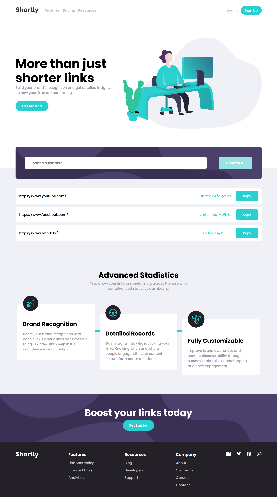

# Frontend Mentor - Shortly URL shortening API Challenge solution

This is a solution to the [Shortly URL shortening API Challenge challenge on Frontend Mentor](https://www.frontendmentor.io/challenges/url-shortening-api-landing-page-2ce3ob-G). Frontend Mentor challenges help you improve your coding skills by building realistic projects. 

## Table of contents

- [Overview](#overview)
  - [The challenge](#the-challenge)
  - [Screenshot](#screenshot)
  - [Links](#links)
- [My process](#my-process)
  - [Built with](#built-with)
  - [What I learned](#what-i-learned)
  - [Useful resources](#useful-resources)
- [Author](#author)


## Overview

### The challenge

Users should be able to:

- View the optimal layout for the site depending on their device's screen size
- Shorten any valid URL
- See a list of their shortened links, even after refreshing the browser
- Copy the shortened link to their clipboard in a single click
- Receive an error message when the `form` is submitted if:
  - The `input` field is empty

### Screenshot




### Links

- Solution URL: [https://www.frontendmentor.io/solutions/url-shortening-api-landing-page-with-react-and-css-di7vcd0gg5](https://www.frontendmentor.io/solutions/url-shortening-api-landing-page-with-react-and-css-di7vcd0gg5)
- Live Site URL: [https://url-shortening-app-fcc-challenge.netlify.app/](https://url-shortening-app-fcc-challenge.netlify.app/)

## My process

### Built with

- Semantic HTML5 markup
- CSS custom properties
- Flexbox
- [React](https://reactjs.org/) - JS library

### What I learned

Save the links in the navigator local storage after you use the fetch function. 

```js
const getShortLink = async (link) => {
    const response=await fetch(`https://api.shrtco.de/v2/shorten?url=${link}`);
  
    const data=await response.json();

    const originalLink=data.result.original_link;
    const shortLink=data.result.short_link;

    const updatedArray=[...fullLinks];

    updatedArray.push({
      fullLink: originalLink,
      shortenedLink: shortLink,
    })
    setFullLinks(updatedArray);
    localStorage.setItem('fullLinks', JSON.stringify(updatedArray));
  }
```

### Useful resources

- [shrtcode API Documentation](https://shrtco.de/docs) - This helped me for XYZ reason. I really liked this pattern and will use it going forward.

## Author

- Website - [Personal Portfolio](https://faustocalvinio.netlify.app/)
- Frontend Mentor - [@faustocalvinio](https://www.frontendmentor.io/profile/faustocalvinio)
